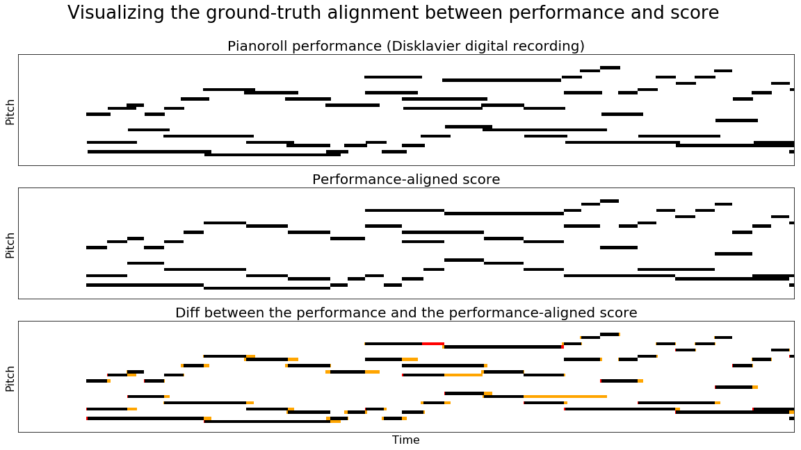
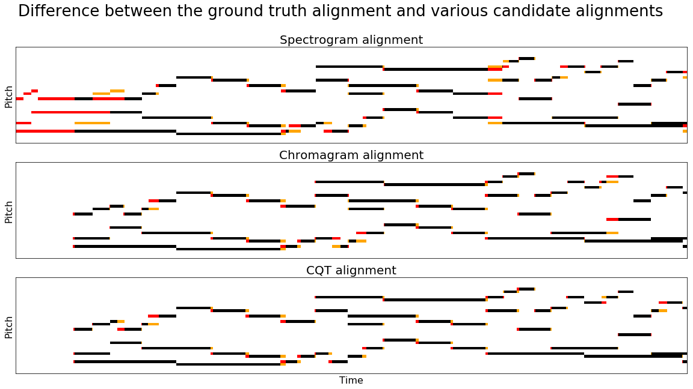

# music-alignment

Experiments and dataset for the paper [Rethinking Evaluation Methodology for Audio-to-Score Alignment](https://arxiv.org/abs/2009.14374).

## Building the Dataset

To get started, first clone a copy of the Bach WTC scores:

```
https://github.com/humdrum-tools/bach-wtc
```

You'll also need a copy of the MAESTRO (v2.0) dataset:

```
https://magenta.tensorflow.org/datasets/maestro#v200
```

After downloading the scores and MAESTRO dataset, you can extract the aligmnent dataset
by calling the `extract` script from the root of this repository:

```
python3 extract.py {path-to-scores}/bach-wtc/ {path-to-maestro}/maestro-v2.0.0
```

The script will extract pairs of KernScores and MAESTRO performances to the data/ subfolder.

To generate the ground-truth alignments, run the following:

```
python3 align.py ground data/score data/perf N
```

The first argument specifes the alignment algorithm (written to an output directory of the same name).
The fourth argument 'N' specifies the number of parallel processes to run (N = 0 runs non-parallel)

## Computing Alignments

You can compute audio-to-score alignments by specifying a particular alignment algorithm:

```
python3 align.py {spectra,chroma,cqt} data/score data/perf N
```

The alignments generated by the alignment script are stored in align/{ground,spectra,chroma,cqt} as
plaintext files with two columns: the first column indicates time in the score, and the second
column indicates time in the performance.

To evaluate the results of a particular alignment algorithm:

```
python3 eval.py {spectra,chroma,cqt,ctc-chroma} data/score data/perf
```

## Interpolating Ground Truths from ASAP

Although checking the reliability of such interpolated annotations is something still in the works, we have added the ability to both generate ground truth annotations and to sonify them + play them alongside the actual performance wav. 

However, first the ASAP files need to be restructured a bit.

```
from extract import restructure_asap_files

restructure_asap_files('/Users/aliamorsi/Desktop/phD/a2s_with_dtw_survey/pitchclass_mctc/data/asap-preludes', 'metadata.csv')
```

Then, run the following to create the ground truth interpolations

```
python3 align.py ground-beat-interpol data/score data/perf 0
```

To sonify them, run:

```
from extract import sonify_interpolated_gt

sonify_interpolated_gt()
```

and by default, the sonified files will be created in eval/sonic.
These files are stereo, with the sonified performance_aligned_gt on one channel and the performance wav on the other.

Open them with audacity, split to have each channel on a separate track, and play with the volume so that they sound even. If playing them together does not seem odd, then there is no problem with the ground truth.

## Visualizations 

To understand the behavior of the ground-truth alignments, we can visually compare the piano-roll
performance (subplot 1) captured by the Yamaha Disklavier to the performance-aligned score created
by warping the score according to the ground-truth alignment (subplot 2). In the comparison plot
(subplot 3) we use red to identify notes that are indicated by the performance-aligned score but
not performed and yellow to identify notes that are performed but not indicated by the
performance-aligned score. This example visualizes the beginning of a performance of the Bach's
Prelude and Fugue in G-sharp minor (BWV 863).



We can also use these visualizations to compare the results of an candidate alignment algorithm to
the ground-truth alignment. In each case, red is used to identify notes that are indicated by the
candidate alignment algorithm, but not by the ground-truth alignment, and yellow is used to
identify notes that are indicated by the ground-truth alignment, but not by the candidate
alignment.



## References

To reference this work, please cite

```bib
@article{thickstun2020rethinking,
  author    = {John Thickstun and Jennifer Brennan and Harsh Verma},
  title     = {Rethinking Evaluation Methodology for Audio-to-Score Alignment},
  journal   = {arXiv preprint arXiv:2009.14374},
  year      = {2020},
}
```

Note to Dev: 
- if you are to add another dtw implementation, make sure that you transpose the audio representations to the format expected by the distance measure used. 
- On the conversion from and to the actual times, 

Todos: 
- add the possibility to only align a subset of the performances in the data folder.


